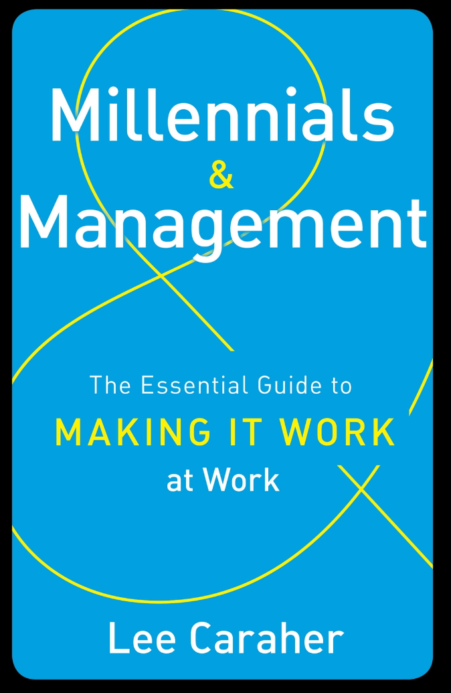
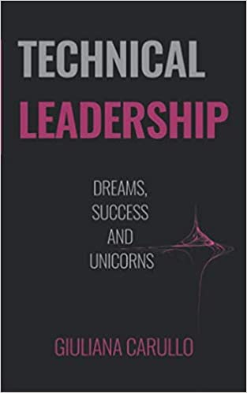
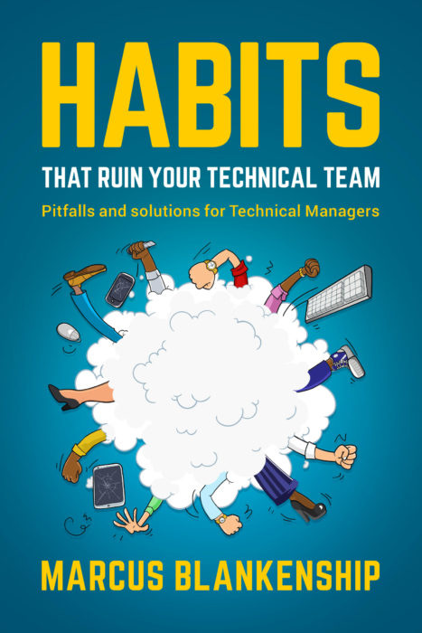
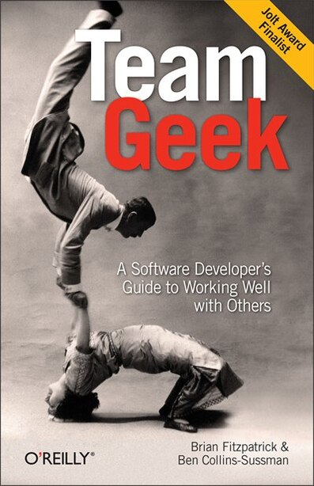
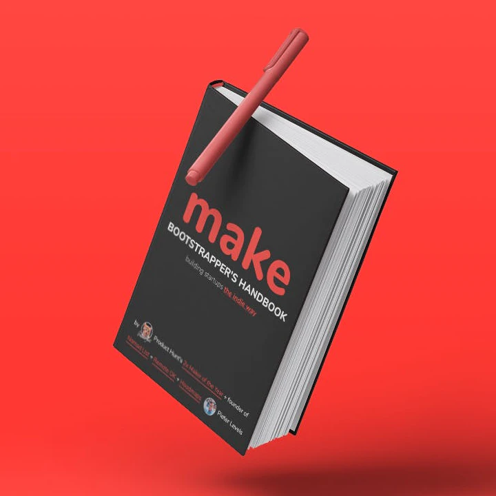

# Libros para administración de equipos de desarrolladores y desarrolladoras

2019 fue un año en donde retomé la lectura y fui abandonando los libros físicos para comprar libros digitales. Además con la ayuda del inglés, he puesto la mira en lecturas que no existen en este idioma o no tienen la esencia del original. Esta lista incluye libros sobre administración de equipos de desarrollo. Espero te sirvan o te animen a leerlos con la reseña corta que haré de cada uno.

> No voy a poner enlaces acá porque puedes tener tu proveedor de libros favorito o los enlaces pueden cambiar entre países.

> Hay libros que sólo pueden encontrarse en inglés. Lo siento.

## 📚 Millenials en la oficina – Lee Caraher (español disponible)

Nos guste o no, los millenials son la generación con mayor fuerza laborar desde 2010. Si eres de una generación anterior a los Millenials aprenderás cómo tratar con ellos, cómo motivarlos y retenerlos en tu empresa. Si eres un Millenial *(como yo)*
,te será útil para comprender a las generaciones anteriores y que es lo que esperan de ti. Lectura que recomiendo independientemente de la generación que pertenezcas.

## 📚 Technical Leadership – Giuliana Carullo (sólo inglés)

¿Te ascendieron de programador a líder técnico? ¿Estás a cargo de un nuevo proyecto y te asignan programadores a tu cargo? ¿Ya estás en ese puesto y de un momento a otro sientes que no sabes cómo organizar o escuchar a tu equipo tecnológico? Este libro te ayuda resolviendo varias interrogantes cuando ahora tienes el liderazgo técnico en tus manos y tu trabajo se convierte de crear código a tratar de crear relaciones con tus compañeros de trabajo.

## 📚 Habits that ruin your technical team – Marcus Blankenship (sólo inglés)

Del mismo estilo que el libro anterior, este corto pero entretenido libro está hecho tanto para emprendedores como líderes técnicos, haciendo un listado de las cosas que **NO**
deberías hacer si tienes a cargo un equipo. Muy recomendado, se puede acabar de leer en menos de 4 horas.

## 📚 Team Geek - A software developer guide to working well with others (sólo inglés)

Dos trabajadores de Google te dan los mejores consejos si trabajas para un equipo de desarrollo. Puedes ser la personas con más experiencia en el equipo. Pero si tienes una falta de trato humano hacia él, el proyecto podría tener problemas. Lectura obligada para todos los desarrolladores o desarrolladoras, incluso si recién están empezando en su carrera.

> Y ahora, un libro extra que habla sobre emprendimiento

## 📚 Make: Bootstrapper’s Handbook – Pieter Levels (sólo inglés)

Este libro nos explica por qué NO necesitas tener una startup para crear un producto rentable. Con la ayuda de automatizaciones, marketing, tiempo y finanzas básicas puedes realizar distintos proyectos y generar una rentabilidad suficiente evitando inversión externa. Recomendado para emprendedores y desarrolladores.
