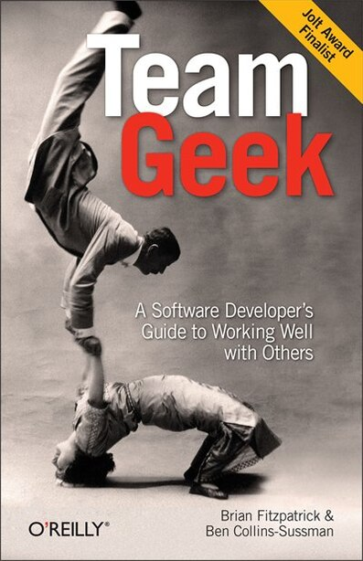

# Des livres sur la gestion des équipes de développeurs et développeuses

2019 a été quand j’ai recommencé à lire et j’ai changé les livres de papier par les livres électroniques. À l’aide de l’anglais, j’ai consommé des lectures qui n’existent pas dans l’espagnol (ma langue maternelle) ou qui n’ont pas l’essence de l’original. Cette liste concerne sur la gestion des équipes de développeurs. J'espère qu'ils vous encourageront à les lire avec le petit résumé que j'ai fait.

> Je ne peux pas écrire les liens ici, parce que tu peux avoir ton magasin de livres préféré ou les liens peuvent changer parmi les pays.

> Tous les noms de livres seront en anglais. Je n’ai pas trouvé les versions en français. Désolé

## 📚 Millennials & Management: The essential guide to making it work at work – Lee Caraher

Qu'on le veuille ou non, la génération dans la plus grande main-d’œuvre est les millénaux. Si tu es d’une génération avant les millénaux, tu apprendras comment à leur parler, à les motiver et à les retenir dans ton entreprise. Si tu es un millénial comme moi, ça va être très utile pour comprendre les générations précédentes et ce qu'elles attendent de toi. Lecture que je recommande, quelle que soit la génération à laquelle tu appartiens.

## 📚 Technical leadership – Giuliana Carullo

As-tu été promu de programmeur à *Tech lead*? As-tu un nouveau projet et tu diriges une équipe? Tu ne sais pas comment organiser une équipe technique? Ce livre t’aidera à résoudre plusieurs des questions lorsque tu as un leadership technique et ton travail passe de la création de code à l'établissement de relations avec tes collègues.

## 📚 Habits that ruin your technical team – Marcus Blankenship

Au même style que ci-dessus, ce petit livre, mais utile. Peut être lu par les *entrepreneurs* et les *tech leads.* Il fait une liste des choses que tu ne devrais pas faire si tu veux diriger une équipe. C’est hautement recommandé, ça peut être terminé en moins de 4 heures.

## 📚 Team Geek - A Software developer guide to working well with others

Deux travailleurs de Google donnent des conseils si tu fais partie d’une équipe de développement. Ils ou elles peuvent être des gens les plus expérimentés de l’équipe. Mais si les développeurs n’ont pas de *soft skills*, le projet pourra avoir des problèmes. C’est une lecture obligatoire pour tous les développeurs ou développeuses, même s’ils/elles commencent une dans le développement.

> Ensuite, un livre additionnel qui parle d'entrepreneuriat

## 📚 Make: Bootstrapper’s Handbook – Pieter Levels

Ce livre nous dit pourquoi on n’a pas besoin d’une startup pour créer un produit rentable. À l’aide d’automatisations, du marketing, du temps et finance de base, tu peux réaliser différents projets et générer de gros profits en évitant l’investissement étrange. Recommandé pour les développeurs et les entrepreneurs.
