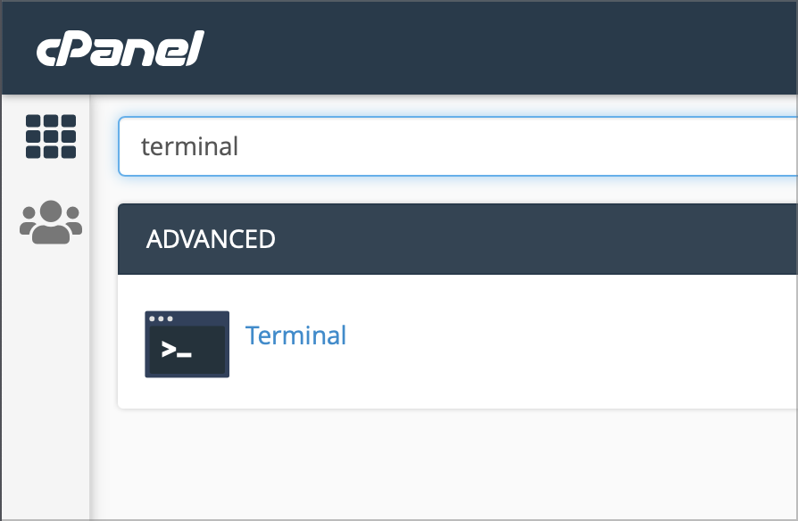

# CPanel: Obtener certificados SSL gratis (no root)

Ya que algunos proveedores de almacenamiento compartido (hosting) te atan a venderte un certificado SSL. Con la ayuda del script `acme.sh`, puedes obtener certificados SSL gratis siguiendo estas instrucciones:

## 📈 Ve a la terminal en tu CPanel o conéctate con SSH



## ⬇️ Descarga el script [acme.sh](http://acme.sh/)

```bash
curl https://get.acme.sh | sh
```

## 🔃 Refresca la terminal

Sal y vuelve a entrar a la terminal o simplemente ejecuta

```bash
source ~/.bashrc
```

## ✉️ Registra el certificado con tu correo electrónico

```bash
acme.sh —-register-account —-accountemail youremail@yourdomain.com
```

## ⏰ Comprueba si el cronjob fue habilitado por acme

```bash
crontab -l | grep acme.sh
```

Este comando debería mostrar algo como esto:

```bash
10 0 * * * “/home/*YOUR_CPANEL_USER*/.acme.sh”/acme.sh —- cron —- home “/home/*YOUR_CPANEL_USER*/.acme.sh” > /dev/null
```

## 📦 Configura las variables del dominio en la terminal

```bash
export DOMAIN=yourdomain.com
# Presiona enter y después escribe
export WWWDOMAIN=www.yourdomain.com
# No te olvides de presionar enter nuevamente
```

## 🔑 Comprueba si la generación de certificado funcionó

Before testing if generate the certificate is allowed. You need the path of the domain / subdomain from your Cpanel. Execute the following command and you’ll get the path

Antes de comprobar si la generación de certificados es permitida. Necesitas el directorio del dominio / subdominio de tu CPanel. Ejecuta el siguiente comando y obtendrás el directorio.

```bash
export DOMAINPATH=$(uapi DomainInfo single_domain_data domain=$DOMAIN | grep documentroot| cut -d " " -f 6)
```

El resultado se almacenará en **DOMAINPATH**

Después, puedes usar Acme para generar un certificado de **STAGING**

```bash
acme.sh —-issue —-webroot ${DOMAINPATH} -d ${DOMAIN} -d ${WWWDOMAIN} —-staging
```

> Sólo agregar `-d $WWWDOMAIN`, si estás usando un alias `www` en tu dominio.

Si recibes mensajes o checks de color verde. ¡Felicidades! Ya puedes generar certificados en tu cuenta CPanel.

## 🍄 Genera un certificado SSL real

```bash
acme.sh —-issue —-webroot ${DOMAINPATH} -d ${DOMAIN} -d ${WWWDOMAIN} —-force
```

## ➕ Agrega tu certificado a CPanel

```bash
acme.sh —-deploy —-deploy-hook cpanel_uapi —-domain ${DOMAIN} --domain ${WWWDOMAIN}
```

> Recuerda, necesitarás repetir cada paso desde “Configura las variables del dominio en la terminal” en adelante por cada dominio / subdominio cuando quieras agregarlo.
