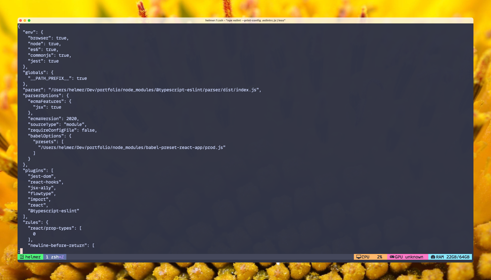

# Eslint: Cómo mostrar la configuración completa de un proyecto

## Primero, mostremos los comandos

Si no quieres entrar en detalles, simplemente usa el siguiente comando.

Recuerda de reemplazar `<tu-archivo-config.js|.json>` con el nombre de tu archivo de configuración de ESLint.

```bash
eslint --print-config <tu-archivo-config.js|.json>
```

Si por alguna razón el comando no se encontró, recuerda que puedes usar `npx` para obtenerlo desde el npm registry o desde tu `node_modules` .

```bash
npx eslint --print-config <tu-archivo-config.js|.json>
```

## ¿Por qué?

A veces quieres saber qué está pasando en tu configuración de ESLint. Especialmente, si comienzas a utilizar diversos plugins (¡Hola Typescript!) o si quieres asegurarte que la configuración por defecto está activada / desactivada.

## Además

Recuerda que es un comando de terminal, puedes combinarlo con herramientas como Bat, Less, Rg o Grep.

Para ambos ejemplos, asumiremos que es el archivo de configuración de ESLint de este blog. Es un archivo llamado `.eslintrc.js` .

### Usa Less si no quieres sintaxis colorida

```bash
npx eslint --print-config .eslintrc.js | less
```



### Usa Bat si quieres sintaxis colorida

Recuerda utilizar la opción `-l` para especificar el lenguaje de programación:

```bash
npx eslint --print-config .eslintrc.js | bat -l json
```


### Almacenándolo en un archivo

Alternativamente, puedes guardar el contenido hacia un archivo que después puedes filtrar con tu herramienta preferida o con tu editor de código:

```bash
npx eslint --print-config .eslintrc.js >> ./eslintconfig.json
```

### Usando rg para filtrarlo

Puedes usar el comando `rg` para buscar una llave específica. Supongamos que queremos encontrar el valor de la llave `no-unused-vars`. Además, voy a agregar 3 líneas de contexto con `-C 3` , ya que la configuración es un json multilínea.

```bash
npx eslint --print-config .eslintrc.js | rg -C 3 "no-unused-vars"
```


### O también puedes usar grep

`Rg` no viene por defecto en muchos sistemas Linux. Si realmente quieres filtrar en un entorno donde no has instalado `rg`, siempre puedes usar `grep`. Como puedes ver, vamos a reusar la misma opción que `rg` para agregar algo de contexto.

```bash
npx eslint --print-config .eslintrc.js | grep -C 3 "no-unused-vars"
```


