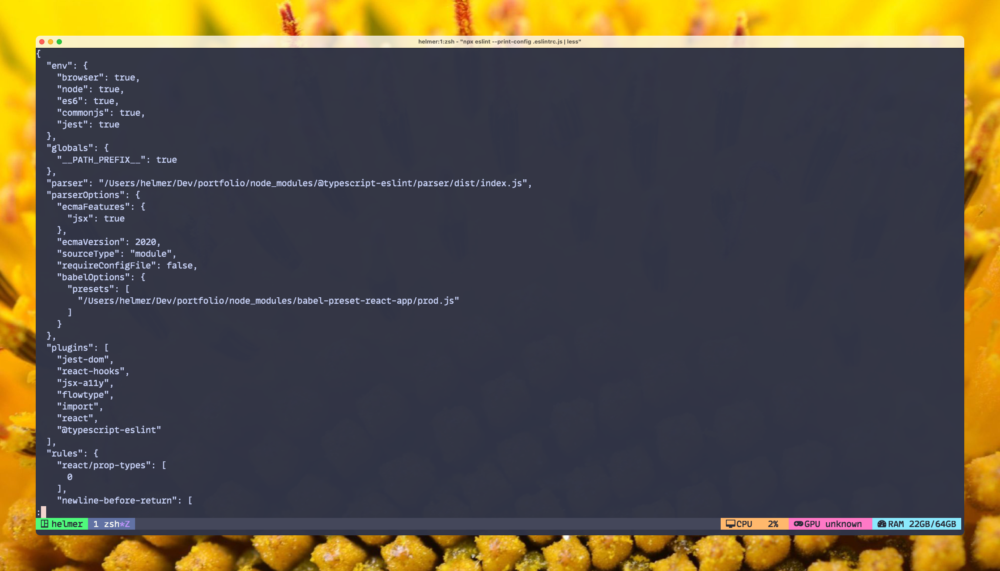
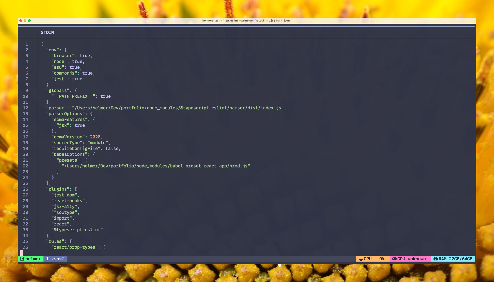
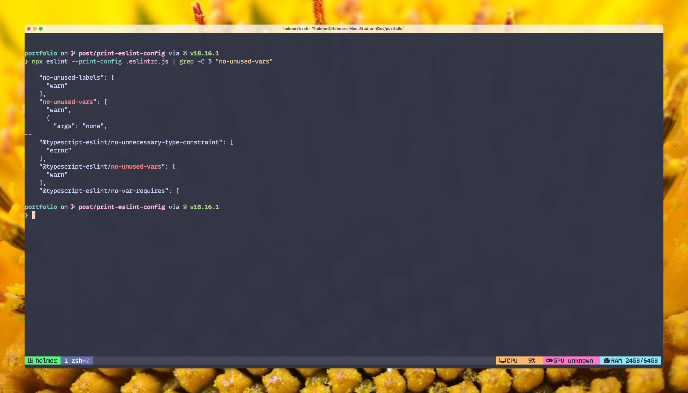

# Eslint: How to print the current configuration from a project

## First, let's write the commands

If you do not require any details, simply use the following command:

Remember to replace `<your-config-file.js|.json>` with your own configuration file name.

```bash
eslint --print-config <your-config-file.js|.json>
```

If for some reason the command is not found, remember that you can use `npx` to fetch it from the NPM registry or use your version from `node_modules` .

```bash
npx eslint --print-config <your-config-file.js|.json>
```

## Why

Sometimes you just want to know what’s going on behind the scenes in your ESLint config, especially if you start using plugins (hello TypeScript!) or if you just want to make sure that one default configuration is enabled or disabled.

## Plus

Remember that since this is a terminal command, you can combine it with tools like Bat, Less, Rg or Grep.

For both examples, let's assume that I'm using the eslint configuration from this blog, which is in a file called `.eslintrc.js`.

### Use Less if you don't want syntax coloring

```bash
npx eslint --print-config .eslintrc.js | less
```



### Use Bat if you want syntax coloring

Remember to use the `-l` option to specify the type of language:

```bash
npx eslint --print-config .eslintrc.js | bat -l json
```



### Saving it to a file

Alternatively, you can save it to a file so that you can query it later with your preferred JSON tool or code editor:

```bash
npx eslint --print-config .eslintrc.js >> ./eslintconfig.json
```

This will create a `eslintconfig.json` file in the same directory, which you can use later.

### Using rg to query it

You can use `rg` command to start searching for a specific key. Let’s suppose that we want to find `no-unused-vars` default value. Also, I’m adding 3 lines of context, `-C 3`, since the config is a multiline json.

```bash
npx eslint --print-config .eslintrc.js | rg -C 3 "no-unused-vars"
```


### And you can use grep as well

Rg doesn't come by default in many Linux OS. If you really need to check it in an environment where you didn't install `rg`, you can always use the `grep` version of it. As you can see, we are going to reuse the same flag from `rg` to add some context.

```bash
npx eslint --print-config .eslintrc.js | grep -C 3 "no-unused-vars"
```


