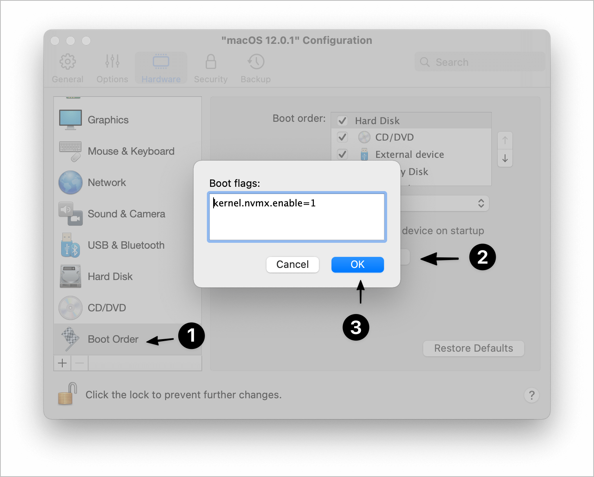

# How to run a macOS VM and Docker together on macOS native using Parallels

I wanted to run macOS inside macOS. But the goal of that task, was running docker in the macOS VM. Since I’m mostly a macOS user and therefore, I prefer to use Parallels, to run my VMs.

> This steps were run inside an Intel Processor i9 series 10. I can’t relate if it will work in a M1 processor.

> Remember, the VM needs to be shut down before updating any configuration

## 🔀 Steps


They’re pretty simple so far. Go to `VM configuration` -> `Hardware` -> `Boot Order` -> `Advanced Settings` -> `Boot Flags` . Write the following text.

```text
kernel.nvmx.enable=1
```



Then, press OK.

Make sure to assign enough RAM to your macOS VM, because it eats a lot.
