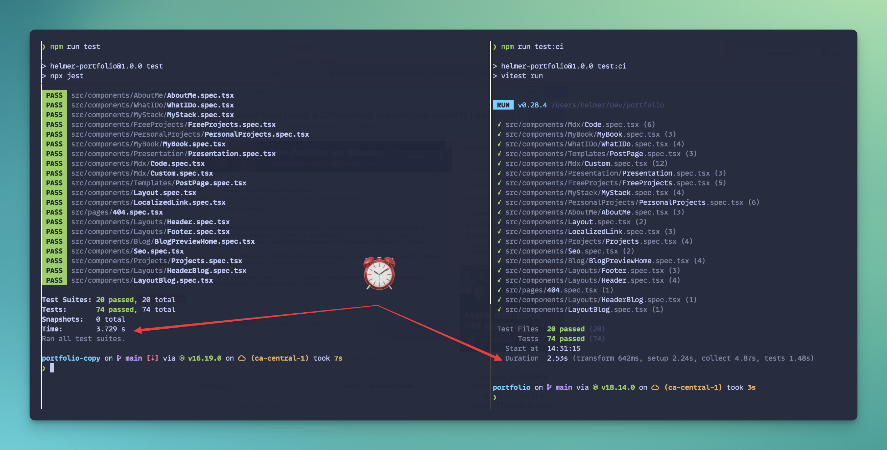
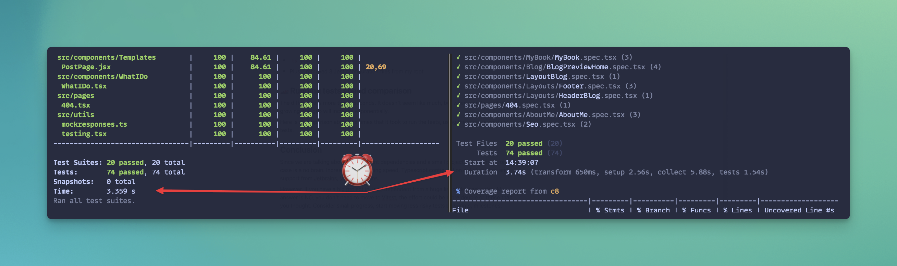

# Migré de Jest a Vitest en menos de 3 horas

## 🤔 ¿Por qué?

Había leído de los múltiples beneficios de Vitest, como velocidad, facilidad para migrar desde Jest y no necesitar de una configuración compleja para integrar Typescript.

Así que, calculé una migración de mi stack de pruebas en unas 6 horas, y me tomó sólo 3. Para ser honesto, pudo haber sido incluso menos, todo depende de tu velocidad al escribir código, complejidad del proyecto y cómo está organizado el código.

## ⚒️ Mi stack actual

A continuación, mi stack actual. Puedes ver cada plugin [en el repositorio](https://github.com/helmerdavila/portfolio/blob/ac0e7d94d48e867c30eb48784aaa349b412c91de/package.json) (antes de la actualización). Pero las tecnologías principales son:

- Gatsby + Typescript sobre Node 18
- Jest
- React test utils
- Eslint + Prettier

## ⚙️ Instalación y creando tu archivo de configuración

Como te puedes imaginar, lo primero por hacer, es instalar Vitest

```bash
npm install -D vitest
```

Pero, si quieres seguir utilizando React Test Utils, trabajar con React y tener _coverage_ de código, instala las siguientes librerías a continuación

```bash
npm install -D @vitejs/plugin-react @vitest/coverage-c8 jsdom
```

<aside>
💡 Si te preguntas por qué `@vitest/coverage-c8` , es la herramienta que utiliza Vitest por defecto, si quieres cambiar a Istanbul, sigue las instrucciones [especificadas de Vitest.](https://vitest.dev/guide/coverage.html#ignoring-code)

</aside>

### Configuración para Typescript

Ya que vamos a trabajar con las definiciones globales para Vitest, agrega el siguiente fragmento de código en tu archivo `tsconfig.json`

```json
{
  "compilerOptions": {
    ...
    "types": [
      "vitest/globals"
    ]
  }
}
```

### vitest.config.ts

Después de instalar las dependencias, crea un archivo `vitest.config.ts` en la raíz de tu proyecto

```tsx
import { defineConfig } from 'vitest/config';
import react from '@vitejs/plugin-react';

export default defineConfig({
  plugins: [react()],
  test: {
    globals: true,
    environment: 'jsdom',
    setupFiles: './vitest-setup.ts',
    include: ['src/**/*.{test,spec}.{js,mjs,cjs,ts,mts,cts,jsx,tsx}'],
    coverage: {
      reporter: ['html', 'json', 'text'],
    },
  },
});
```

Voy a explicar por qué agregué algunas opciones a la configuración:

- La función `react()` , dentro de la sección de plugins, agrega soporte para la sintaxis de React.
- La propiedad `globals` establece todas las funciones comunes de prueba, como globales, entre ellas `describe`, `it`, `expects` y así sucesivamente.
- `environment` como `jsdom` . Puedes comprobar cuando instalamos la biblioteca, agregará soporte para consultar el DOM cuando trabajamos con `react-test-utils`.
- La propiedad `setupFiles` hace referencia a `./vitest-setup.ts`. Un archivo que cubriremos en profundidad más adelante.
- En la parte `include`, puede agregar una expresión regular de formatos y nombres de archivos que se observarán en el comando de prueba. Como puedes ver, he agregado soporte incluso a `mjs, cjs`, sintaxis de módulo para futures versiones de Javascript.
- `coverage`, donde puedes especificar los formatos de reporte de la herramienta de _coverage_

### vitest-setup.ts

Este archivo de configuración es donde podemos especificar algunas acciones, antes de que todos los tests se ejecuten. Aquí, agregué una conexión entre Testing Library y Vitest.

Después de cada test, limpiaremos los resultados al renderizar los componentes de React (`afterEach`).

```tsx
import { afterEach } from 'vitest';
import '@testing-library/jest-dom';
import matchers from '@testing-library/jest-dom/matchers';
import { cleanup } from '@testing-library/react';

expect.extend(matchers);

afterEach(() => {
  cleanup();
});
```

## ♻️ Actualizando los Mocks

Si has hecho frecuentemente los Mocks de Jest en tu proyecto, podría demorar la migración de tu proyecto más de lo anticipado. Vitest ofrece una fácil compatibilidad con los mocks creados en Jest, y he aquí algunos tips que usé (o descubrí) mientras estaba realizando la migración. Siempre recomiendo [leer la documentación oficia](https://vitest.dev/guide/mocking.html)l.

### Reemplaza jest con vi

Ejemplo: para el uso de `vi.fn()` . En el siguiente archivo en mi portafolio, `__mocks__/gatsby-background-image.ts`, observa como realizo el reemplazo.

```diff

import React from 'react';
+ import { vi } from 'vitest';

- export default jest.fn().mockImplementation(({ children }) => React.createElement('div', null, children));
+ export default vi.fn().mockImplementation(({ children }) => React.createElement('div', null, children));
```

### Reemplaza requireActual con importActual

Usaremos de ejemplo mi archivo `__mocks__/gatsby.ts` . Además comprueba el uso de `await` .

```diff
import React from 'react';
- const gatsby = jest.requireActual('gatsby');
+ import { vi } from 'vitest';

+ const gatsby = await vi.importActual<object>('gatsby');

const mockImage = ({ imgClassName, ...props }) => React.createElement('img', { ...props, className: imgClassName });

module.exports = {
  ...gatsby,
-  graphql: jest.fn(),
-  Link: jest.fn().mockImplementation(mockLink),
-  StaticQuery: jest.fn(),
-  useStaticQuery: jest.fn(),
-  GatsbyImage: jest.fn().mockImplementation(mockImage),
-  StaticImage: jest.fn().mockImplementation(mockImage),
+  graphql: vi.fn(),
+  Link: vi.fn().mockImplementation(mockLink),
+  StaticQuery: vi.fn(),
+  useStaticQuery: vi.fn(),
+  GatsbyImage: vi.fn().mockImplementation(mockImage),
+  StaticImage: vi.fn().mockImplementation(mockImage),
};
```

### Antes de usar cualquier Mock en los tests, llama al Mock

¿Qué pasaría si quisiera usar mi archivo mostrado arriba? Impórtalo antes de los tests, o de acuerdo a los casos que estés codificando.

```tsx
vi.mock('gatsby');
```

Si necesitas usar múltiples mocks, a continuación una demostración.

```tsx
vi.mock('gatsby');
vi.mock('gatsby-plugin-image');
vi.mock('react-slick');
```

### Creando un mock antes de cada test

¿Quíeres tener autocompletado para mocks escritos en Typescript sólo para un archivo? Observa como agrego soporte de autocompletado.

El autocompletado comenzará al acabar de escribir `(useStaticQuery as Mock)`.

```tsx
import { loadTranslations } from '../../utils/mockresponses';
import type { Mock } from 'vitest';

beforeEach(() => {
  (useStaticQuery as Mock).mockReturnValueOnce(loadTranslations);
});
```

### ¿Cambiando spyes?, usa vi.spyOn

```diff
- const getItemMock = jest.spyOn(window.localStorage.__proto__, 'getItem');
+ const getItemMock = vi.spyOn(window.localStorage.__proto__, 'getItem');
```

## ⏬ Actualizando comandos de NPM

Los comandos Vitest corren por defecto en modo `watch`. Utiliza la opción `run` para evitar déjarlos en ejecución.

Yo creé comandos alternos que puedo ejecutar en Github Actions. Comprueba mi `package.json` .

```json
{
	"scripts": {
		...
    "test": "vitest",
    "test:ci": "vitest run",
    "test:cov": "vitest run --coverage"
  },
}
```

## 🔨 Github Actions

Por mala suerte, [el plugin que usé para crear los reportes](https://github.com/ArtiomTr/jest-coverage-report-action) de mi _coverage_ de código no es compatible con Vitest. Espero en el futuro encrontrar uno similar, ya que no tengo el tiempo de hacer un _fork_ y modificarlo.

En Github Actions, así es como aun sigo corriendo y validando mis tests.

```yaml
name: Tests
on:
  pull_request:
    branches:
      - main
jobs:
  coverage:
    name: Coverage
    runs-on: ubuntu-latest
    env:
      NODE_OPTIONS: --max-old-space-size=4096
    steps:
      - uses: actions/checkout@v3
      - uses: actions/setup-node@v3
        with:
          node-version-file: '.nvmrc'
          cache: npm
      - name: Installing dependencies
        run: npm ci
      - name: Running tests
        run: npm run test:cov
```

## 🗑️ Remueve las referencias a Jest

Para mi portafolio, ya no necesitaba las siguientes librerías:

- `@types/jest`
- `babel-jest`
- `jest`
- `ts-jest`
- Adicionalmente, removí tres archivos de configuración desde la raíz de mi proyecto.

## 🏎️ Corriendo tests y comparando la velocidad

Para 74 tests que tengo el día que estoy escribiendo esto, la diferencia entre Jest y Vitest es sólo de 1 segundo, donde Vitest es el ganador. No se ve como mucho, pero cuando la cantidad de tus tests comienza a incrementarse, la diferencia se incrementará, por supuesto.

Aquí una comparación entre Jest y Vitest corriendo la misma suite de tests.





## ☑️ Conclusión

Ya que estamos escribiendo sobre dependencias de un entorno de desarrollo y un proyecto pequeño, usar Vitest en este caso será una buena idea. Aumentos en la velocidad de ejecución de tests, configuración de Typescript por defecto y soporte para Jetbrains y Vscode.

Sin embargo, si tienes un proyecto grande en Jest, que depende de una gran lista de dependencias. Mi respuesta es NO, no necesitas moverte a Vitest, el esfuerzo podría ser el doble o el triple más de lo que hayas pensado. Considera pequeños avances, comienza a mover tests pequeños que no causen riesgo, _sprint_ por _sprint_, en _milestones_.

Puedes comprobar mi PR de mi portafolio [en este enlace.](https://github.com/helmerdavila/portfolio/pull/96)

## 🔗 Enlaces externos

- [https://www.lekoarts.de/garden/testing-gatsby-s-head-api-with-vitest-and-playwright](https://www.lekoarts.de/garden/testing-gatsby-s-head-api-with-vitest-and-playwright)
- [https://www.robinwieruch.de/vitest-react-testing-library/](https://www.robinwieruch.de/vitest-react-testing-library/)
