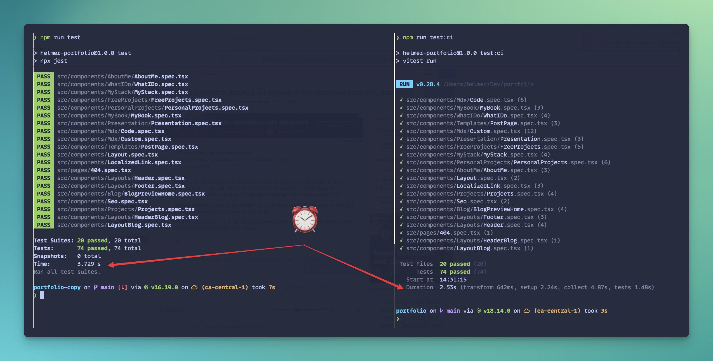

# I moved from Jest to Vitest in less than 3 hours

## 🤔 Why?

I've read about the multiple benefits of Vitest, such as speed, ease of transitioning from Jest, and no need for a complex Typescript configuration. So, I calculated that a migration of my test stack could be done in less than 6 hours, and it only took me 3 hours. To be honest, it could have been even less. It all depends on your coding speed, the complexity of the project, and the code organization.

## 🛠️ My Current Stack

This is my current stack; you can see every plugin [in the project's repository](https://github.com/helmerdavila/portfolio/blob/ac0e7d94d48e867c30eb48784aaa349b412c91de/package.json) (before the upgrade). But the main ones are:

- Gatsby + Typescript over Node 18
- Jest
- React Test Utils
- ESLint + Prettier

## ⚙️ Setup and creating your config file

Wondering what to do first? Install Vitest!

```bash
npm install -D vitest
```

But if you want to use React Test Utils, work with React, and add code coverage, install the following libraries as well.

```bash
npm install -D @vitejs/plugin-react @vitest/coverage-c8 jsdom
```

> If you're wondering why `@vitest/coverage-c8` is the coverage report tool that Vitest uses by default, follow the instructions [from Vitest](https://vitest.dev/guide/coverage.html#ignoring-code) if you want to change to Instanbul.

### Typescript file

Since we are going to work with global definitions for Vitest, add the following piece of code to your `tsconfig.json` file.

```json
{
  "compilerOptions": {
    ...
    "types": [
      "vitest/globals"
    ]
  }
}
```

### vitest.config.ts

After installing dependencies, create a `vitest.config.ts` in the root of your project

```tsx
import { defineConfig } from 'vitest/config';
import react from '@vitejs/plugin-react';

export default defineConfig({
  plugins: [react()],
  test: {
    globals: true,
    environment: 'jsdom',
    setupFiles: './vitest-setup.ts',
    include: ['src/**/*.{test,spec}.{js,mjs,cjs,ts,mts,cts,jsx,tsx}'],
    coverage: {
      reporter: ['html', 'json', 'text'],
    },
  },
});
```

I've added some options to that config:

- The `react()` function in the plugins section adds support for React syntax understanding.
- The `globals` property sets common testing functions (e.g. `describe`, `it`, `expect`) as globals.
- `environment` is set to `jsdom`. This adds support for querying the DOM when working with `react-test-utils`.
- The `setupFiles` property references `./vitest-setup.ts`. We'll cover this file in depth later.
- The `include` part adds a regex of formats and filenames that will be picked up from the test command. I've added support for `mjs` and `cjs`, which are future Javascript module syntaxes.
- `coverage` specifies the output format of the coverage tool.

### vitest-setup.ts

The setup file is where we can specify some actions, before all tests are run. Here I’ve added the connection between the Testing Library and Vitest.

After every test, we keep cleaning the results of generating the React components (`afterEach`).

```tsx
import { afterEach } from 'vitest';
import '@testing-library/jest-dom';
import matchers from '@testing-library/jest-dom/matchers';
import { cleanup } from '@testing-library/react';

expect.extend(matchers);

afterEach(() => {
  cleanup();
});
```

## ♻️ Updating Mocks

If you have extensive use of Jest Mocks in your project, it can delay your migration more than expected. Vitest offers easy compatibility with Jest's created Mocks, and here are some quick tips that I used (or discovered) while performing the migration. I always recommend that you refer to [their official documentation](https://vitest.dev/guide/mocking.html).

### Replace jest with vi

Example: Use `vi.fn()` commonly. In the next file of my project, `__mocks__/gatsby-background-image.ts`, check how to replace its content.

```diff

import React from 'react';
+ import { vi } from 'vitest';

- export default jest.fn().mockImplementation(({ children }) => React.createElement('div', null, children));
+ export default vi.fn().mockImplementation(({ children }) => React.createElement('div', null, children));
```

### Replace requireActual with importActual

Let’s check my file `__mocks__/gatsby.ts` . Also, check the `await` usage

```diff
import React from 'react';
- const gatsby = jest.requireActual('gatsby');
+ import { vi } from 'vitest';

+ const gatsby = await vi.importActual<object>('gatsby');

const mockImage = ({ imgClassName, ...props }) => React.createElement('img', { ...props, className: imgClassName });

module.exports = {
  ...gatsby,
-  graphql: jest.fn(),
-  Link: jest.fn().mockImplementation(mockLink),
-  StaticQuery: jest.fn(),
-  useStaticQuery: jest.fn(),
-  GatsbyImage: jest.fn().mockImplementation(mockImage),
-  StaticImage: jest.fn().mockImplementation(mockImage),
+  graphql: vi.fn(),
+  Link: vi.fn().mockImplementation(mockLink),
+  StaticQuery: vi.fn(),
+  useStaticQuery: vi.fn(),
+  GatsbyImage: vi.fn().mockImplementation(mockImage),
+  StaticImage: vi.fn().mockImplementation(mockImage),
};
```

### Before using any Mock, add a reference of it

What if I want to use my `__mocks__/gatsby.ts` showed above? Import it before the tests, or according your test cases.

```tsx
vi.mock('gatsby');
```

If you need to use multiple mocks, here is how.

```tsx
vi.mock('gatsby');
vi.mock('gatsby-plugin-image');
vi.mock('react-slick');
```

### Mocking only before every test

Do you want to have autocompletion in Typescript for mocks created only for a certain file? Check how I add autocomplete support to my mocks.

Autocomplete will start once you finish typing `(useStaticQuery as Mock)` .

```tsx
import { loadTranslations } from '../../utils/mockresponses';
import type { Mock } from 'vitest';

beforeEach(() => {
  (useStaticQuery as Mock).mockReturnValueOnce(loadTranslations);
});
```

### Spyes changes?, use vi.spyOn

```diff
- const getItemMock = jest.spyOn(window.localStorage.__proto__, 'getItem');
+ const getItemMock = vi.spyOn(window.localStorage.__proto__, 'getItem');
```

## ⏬ Updating NPM commands

Vitest commands are ran in `watch` mode by default. Use the `run` option to avoid leaving them running.

I created alternated commands that I can execute in Github Actions. Check my `package.json`

```json
{
  "scripts": {
    "test": "vitest",
    "test:ci": "vitest run",
    "test:cov": "vitest run --coverage"
  }
}
```

## 🔨 Github Actions

Unfortunately, [the plugin that I used](https://github.com/ArtiomTr/jest-coverage-report-action) to create a report of my coverage is not compatible with Vitest. I hope in the future I will be able to find a similar one, as I have no time to create a fork and modify it.

In Github Actions, this is how I keep running and validating my tests.

```yaml
name: Tests
on:
  pull_request:
    branches:
      - main
jobs:
  coverage:
    name: Coverage
    runs-on: ubuntu-latest
    env:
      NODE_OPTIONS: --max-old-space-size=4096
    steps:
      - uses: actions/checkout@v3
      - uses: actions/setup-node@v3
        with:
          node-version-file: '.nvmrc'
          cache: npm
      - name: Installing dependencies
        run: npm ci
      - name: Running tests
        run: npm run test:cov
```

## 🗑️ Removing Jest references

For my portfolio, I no longer needed the following libraries:

- `@types/jest`
- `babel-jest`
- `jest`
- `ts-jest`
- Additionally, I removed three Jest configuration files from my root.

## 🏎️ Running tests speed comparison

For 74 tests that I have when I’m writing this post, the difference is more than 1 second, having Vitest as a winner. It doesn’t seem like much, but when your tests start growing, the gap will increase, of course.

Here is a comparison about the times that it took to run the tests, using the same quantity of tests.




## ☑️ Conclusion

Since we are talking about development dependencies and a small project. Using Vitest for this case is a no brain. Increased test running speed, Typescript configuration out of the box and support from Jetbrains and Vscode.

However, if you have a big project in Jest, dependent from a huge list of dependencies. My answer is NO, you don’t need to move to Vitest, the effort could be more double or thrice than you thought. Consider small progress, start moving less risky tests by sprints, milestones.

You can check my full PR for my portfolio [clicking this link.](https://github.com/helmerdavila/portfolio/pull/96)

## 🔗 External Links

- [https://www.lekoarts.de/garden/testing-gatsby-s-head-api-with-vitest-and-playwright](https://www.lekoarts.de/garden/testing-gatsby-s-head-api-with-vitest-and-playwright)
- [https://www.robinwieruch.de/vitest-react-testing-library/](https://www.robinwieruch.de/vitest-react-testing-library/)
