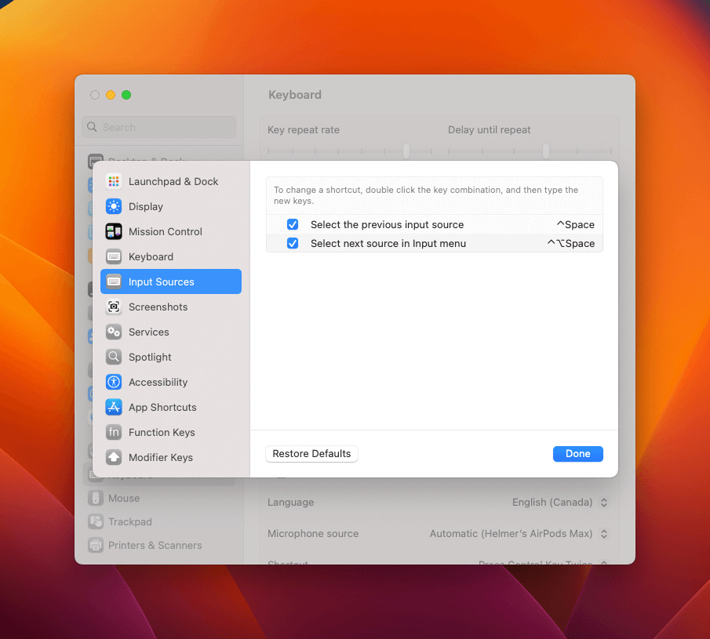

# Tmux: Le préfixe Ctrl-Space ne fonctionne pas sur macOS

## 🤔 Comment c’est arrivé?

C’est le jour pour configurer mon nouveau Mac. Après que j’ai fini l’installation de mon profile Tmux avec tous les plugiciels que j’en ai besoin. Le raccourci Ctrl-Space n’a fonctionne pas. J’ai essayé la même commande sur tous mes terminaux \*\*qui j’ai: Kitty, Alacritty et Terminal.app.

J’ai changé le raccourci du préfixe par défaut `Ctrl-B` ou `^-B`, car je sens qui est le plus flexible.

C’est très étrange, parce que le même raccourci fonctionne dans mon vieux (mais puissante) Macbook 2019.

En voici la configuration que j’ai dans mon fichier `~/.tmux.conf` .

```nginx
# Pour changer le préfixe
unbind C-b
set-option -g prefix C-Space
bind-key C-Space send-prefix
```

## 🔨 La solution

Il y a un raccourci par défaut dans Mac, utilisé pour se déplacer parmi les sources d’entrée. Tu devrais aller à `Mac settings` → `Keyboard` → `Keyboard shortcuts` → `Input sources` (désolé, je ne connais pas les options en français). Après ça, désactive les deux raccourcis là-bas.

## 📷 Captures d’écran

Trouver l’option peut être compliqué. Ensuite je vais ajouter des quelques captures d’écran que j’ai prises de macOS Ventura.




