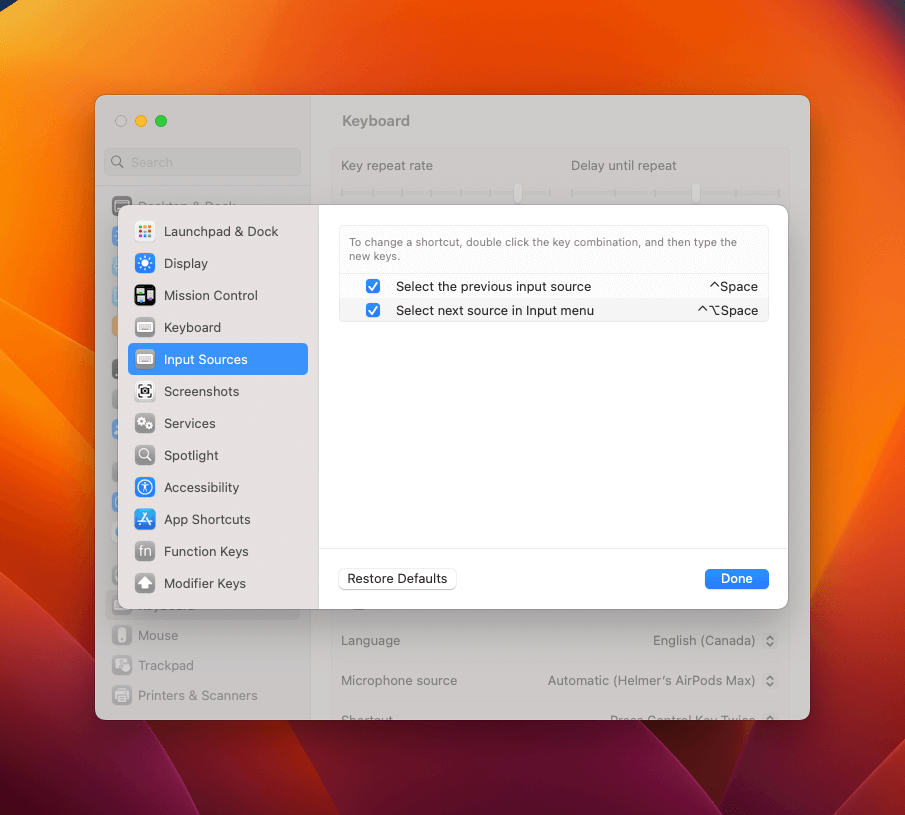

# Tmux: Prefix Ctrl-Space not working on macOS

## 🤔 How did this happen?

I was configuring a new Mac. And after installing my Tmux profile with all the plugins that I needed. The shortcut wasn’t working. I tried the same command in all my terminals that I have installed: Kitty, Alacritty and the Terminal.app.

I changed the default Tmux shortcut `Ctrl-B` or `^-B` to `^-Space`, because I feel it is more flexible.

It was really weird because the same shortcut was working in my old (but strong) Macbook from 2019.

This is the config that I have in my `~/.tmux.conf`

```nginx
# Rebind prefix key
unbind C-b
set-option -g prefix C-Space
bind-key C-Space send-prefix
```

## 🔨 The solution

There is a default shortcut on Mac used to move between input sources. You’ll need to go to your `Mac settings` → `Keyboard` → `Keyboard Shortcuts` → `Input sources`. Then, disable both shortcuts over there.

## 📷 Screenshots

Finding the option could be complicated. I’ll post the screenshots that I took from macOS Ventura.




