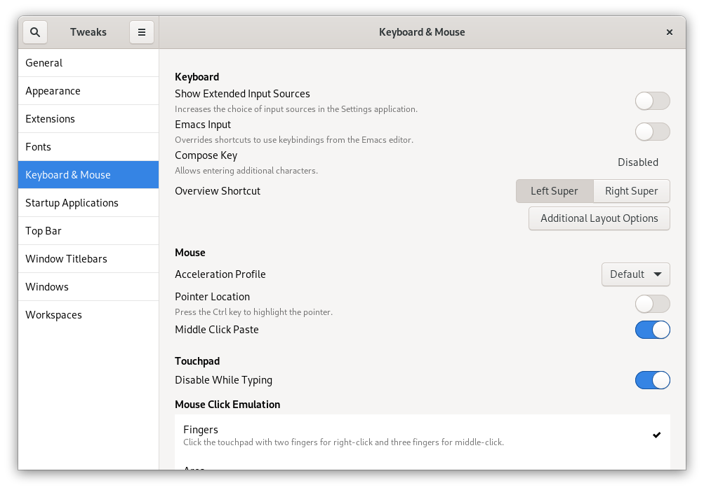
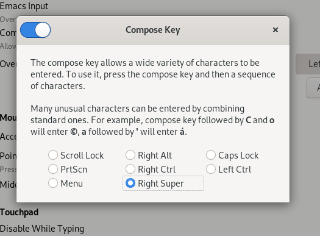
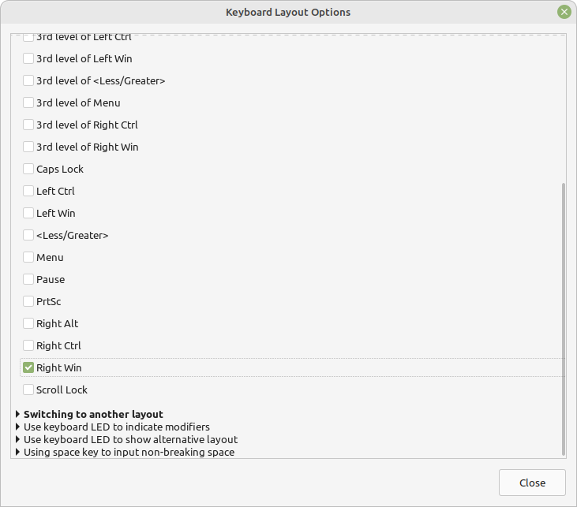

# Write in French, Spanish and English using a single keyboard

As you probably saw in my blog, I usually write in the three languages that I can: English, French and Spanish. Since most of my days I spent time coding rather than writing blog posts, using an english keyboard was my choice from the beginning. I only faced an issue long time ago, when I moved my current writing flow from spanish to english, my mind was totally lost with some key positions, especially for the accents and the Ñ. Things got worse when I decided to start writing in french because they have more additional characters. So, I began to research to keep my current coding keyboards ~~because I’m a keyboard shopper addict~~ while I’m able to write in different languages.

## 🍎 MacOS

For me, this is one of the most straightforward combinations together with Linux, because it comes by default and it’s shared among iPhone or iPad devices. I tested it in an english layout.

## Shortcuts

`Option ⌥` + `e` + `a / e / i / o / u` = `á, é, í, ó, ú`

`Option ⌥` + `i` + `a / e / i / o / u` = `â, ê, î, ô, û`

`Option ⌥` + `u` + `a / e / i / o / u` = `ä, ë, ï, ö, ü`

`Option ⌥` + `` ` `` + `a / e / i / o / u` = `à, è, ì, ò, ù`

`Option ⌥` + `c / C` = `ç / Ç`

`Option ⌥` + `n` + `n / N` = `ñ / Ñ`

`Option ⌥` + `1 (below !)` = `¡`

`Option ⌥` + `? (use Shift)` = `¿`

## 🪟 Windows

Just be sure that your current keyboard is supporting the **United States International keyboard layout**. You can change between multiple languages with the `Win Key` + `Space bar`. In the following example, ignore the language (French Canada) because I use it for corrections. Take a look to the text below, that’s the layout.

### Shortcuts

`~` + `n / N` = `ñ / Ñ`

`‘` + `c / C` = `ç / Ç`

`‘` + `a / e / i / o / u` = `á, é, í, ó, ú`

`^` + `a / e / i / o / u` = `â, ê, î, ô, û`

`“` + `a / e / i / o / u` = `ä, ë, ï, ö, ü`

`` ` `` + `a / e / i / o / u` = `à, è, ì, ò, ù`

`Right Alt` + `1 (below !)` = `¡`

`Right Alt` + `/` = `¿`

## 🐧 Linux

This was tested on Debian with Gnome. First, you need to go to the Tweaks Menu and then enable the Compose key option. It will open a menu. I chose Right super (Right Windows Key) because I rarely use that key.
Of course, you can pick any other key that you want. Just make sure to remember the combination. Since I went with the `Right Super` key (Right Windows key), then the next shortcuts will be displayed with that.

For Linux Mint, it’s located into the Keyboard application. Then you can click in options.

### Debian configuration

### Linux Mint configuration

### Shortcuts

`Super` + `‘` + `a / e / i / o / u` = `á é í ó ú`

`Super` + `~` + `n / N` = `ñ Ñ`

`Super` + `` ` `` + `a / e / i / o / u` = `à, è, ì, ò, ù`

`Super` + `^` + `a / e / i / o / u` = `â, ê, î, ô, û`

`Super` + `“` + `a / e / i / o / u` = `ä, ë, ï, ö, ü`

`Super` + `,` + `c / C` = `ç, Ç`

`Super` + `?` + `?` = `¿`

`Super` + `!` + `!` = `¡`
